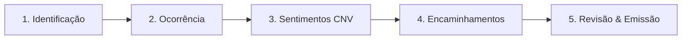

# 📘 POME - Plataforma de Observação e Melhoria do Clima Escolar
> **Documentação Completa do Sistema e Funcionalidades**

O **POME** (Plataforma de Observação da Melhoria do Clima Escolar) é um sistema web integrado desenvolvido para o registro sistemático, mediação pedagógica de conflitos, escuta qualificada baseada na Comunicação Não-Violenta (CNV), acompanhamento diretivo e análise estatística para a rede municipal de ensino.

---

## 🧭 Índice Geral
1. [Arquitetura & Tecnologias](#1-arquitetura--tecnologias)
2. [Perfis de Acesso & Níveis de Permissão](#2-perfis-de-acesso--níveis-de-permissão)
3. [Autenticação e Autocadastro](#3-autenticação-e-autocadastro)
4. [Fluxo do Registro de Atendimento em 5 Passos](#4-fluxo-do-registro-de-atendimento-em-5-passos)
5. [Taxonomia Científica do Clima Escolar (3 Níveis)](#5-taxonomia-científica-do-clima-escolar-3-níveis)
6. [Regra de Vistos da Direção Escolar](#6-regra-de-vistos-da-direção-escolar)
7. [Rastreabilidade, Auditoria & Histórico de Edições](#7-rastreabilidade-auditoria--histórico-de-edições)
8. [Conformidade LGPD & Anonimização em 1 Clique](#8-conformidade-lgpd--anonimização-em-1-clique)
9. [Painel do Dashboard & Indicadores em Tempo Real](#9-painel-do-dashboard--indicadores-em-tempo-real)
10. [Módulo de Consultas & Filtros Avançados](#10-módulo-de-consultas--filtros-avançados)
11. [Relatórios Analíticos & Telemetria da Rede](#11-relatórios-analíticos--telemetria-da-rede)
12. [Gestão de Escolas e Usuários](#12-gestão-de-escolas-e-usuários)
13. [Painel Master de Auditoria & Backups (Super Admin)](#13-painel-master-de-auditoria--backups-super-admin)
14. [Emissão de Folha de Atendimento A4 para Impressão](#14-emissão-de-folha-de-atendimento-a4-para-impressão)

---

## 1. Arquitetura & Tecnologias

* **Frontend:** React 19, Vite, Vanilla CSS customizado com Design System institucional, tema Claro/Escuro (Dark Mode).
* **Backend:** Node.js com Express API REST.
* **Banco de Dados Híbrido:**
  * **Nuvem:** Supabase (PostgreSQL) com detecção automática de schema.
  * **Local / Offline Fallback:** Persistência automática em `server/db.json`.
* **Segurança & Auditoria:** Armazenamento estruturado de logs (`server/logs/pome_activity.log`) e snapshots incrementais de backup (`server/backups/`).

---

## 2. Perfis de Acesso & Níveis de Permissão

| Perfil | Escopo de Visualização | Principais Ações Permitidas |
|---|---|---|
| 👑 **Super Admin** | Toda a rede municipal | Auditoria técnica, telemetria do servidor, backups, auditoria de logs, impersonação de perfis e gestão total de dados. |
| 🏛️ **SEDUC / Gestor Central** | Todas as escolas do município | Relatórios consolidados da rede, telemetria comparativa entre escolas, cadastro e gerenciamento de escolas e usuários, exportação SPSS/CSV. |
| 💼 **Diretor(a)** | Escola vinculada | Visualização de 100% das ocorrências da sua escola, visto e homologação pedagógica, emissão de folhas A4, acompanhamento de pendências. |
| ✏️ **Pedagogo(a)** | Escola vinculada | Registro de atendimentos em 5 passos, salvamento de rascunhos, edição de ocorrências próprias (antes do visto), emissão de folhas A4. |
| 🤝 **Assistente Escolar / Mediador** | Escola vinculada | Registro de mediações, consulta de atendimentos da unidade e apoio ao núcleo pedagógico. |

---

## 3. Autenticação e Autocadastro

* **Entrada no Sistema:** Login unificado via CPF (com formatação automática `000.000.000-00`) ou E-mail institucional (`@edu.contagem.mg.gov.br`) e senha, com botão para exibir/ocultar senha.
* **Credenciais Padrão Pré-Configuradas para Testes e Homologação:**

| Perfil / Cargo | Nome do Usuário | CPF de Acesso | E-mail Institucional | Senha Padrão | Escopo |
|---|---|---|---|---|---|
| 👑 **Super Admin** | Elisabette Leo | `000.000.000-00` | `admin@edu.contagem.mg.gov.br` | `admin123` *(ou `admin`)* | Toda a Rede |
| 👑 **Super Admin** | Felipe Marcelino | `999.999.999-99` | `felipe@edu.contagem.mg.gov.br` | `2018@Senha` | Toda a Rede |
| 🏛️ **Gestor SEDUC** | Gestão Central SEDUC | `111.111.111-11` | `gestor@edu.contagem.mg.gov.br` | `seduc123` *(ou `seduc` / `admin`)* | Rede Municipal |
| 💼 **Diretor(a)** | Diretor(a) Wancleber | `222.222.222-22` | `diretor@edu.contagem.mg.gov.br` | `diretor123` *(ou `senha`)* | Escola Wancleber |
| ✏️ **Pedagogo(a)** | Pedagoga Maria Silva | `333.333.333-33` | `pedagogo@edu.contagem.mg.gov.br` | `pedagogo123` *(ou `senha`)* | Escola Wancleber |
| 🤝 **Assistente Escolar** | Assistente de Mediação | `444.444.444-44` | `assistente@edu.contagem.mg.gov.br` | `assistente123` *(ou `senha`)* | Escola Wancleber |

* **Botão "📝 Cadastre-se":** Permite a novos servidores solicitarem acesso diretamente pela tela inicial.
* **Formulário de Cadastro Completo:**
  * CPF e E-mail Institucional (`@edu.contagem.mg.gov.br`).
  * Nome Completo e Telefone.
  * Seleção de Perfil (Pedagogo, Diretor, Assistente, SEDUC).
  * Seleção da Unidade / Escola municipal.
  * Criação de Senha e Confirmação de Senha (mínimo de 4 dígitos).
  * **Termo de Consentimento LGPD (Lei nº 13.709/2018):** Declaração explícita de compromisso com sigilo pedagógico e tratamento de dados.
* **Acesso Imediato:** Conta criada e autenticada imediatamente após o cadastro.

---

## 4. Fluxo do Registro de Atendimento em 5 Passos

O formulário progressivo do POME foi desenhado para garantir rigor metodológico e acolhimento socioemocional:

### 👤 Passo 1: Identificação dos Envolvidos
* Suporte a **múltiplos estudantes** envolvidos no mesmo atendimento.
* Coleta de: Nome completo, Sexo, **Turno escolar (Dropdown: Matutino, Vespertino, Noturno, Integral)**, Ano/Ciclo escolar, Turma, Nome do Professor e **Componente Curricular / Matéria (Dropdown com opções padronizadas da BNCC)**.
* Identificação do **Responsável Legal:** Nome, grau de parentesco e telefone de contato com máscara.
* Seleção de data com tratamento de fuso horário local.

### 📝 Passo 2: Assunto e Classificação do Atendimento
* **Relato do Ocorrido Primeiro:** Campo detalhado para descrição dos fatos, com contador de caracteres (mínimo de 10 caracteres).
* **Aviso em Destaque Vermelho:** `(Não citar nomes de pais/responsáveis, professores e alunos neste campo.)` para salvaguarda de sigilo.
* **Classificação Multinível:** Seleção de uma ou mais categorias da árvore taxonômica científica.

### 💖 Passo 3: Sentimentos Identificados (Comunicação Não-Violenta - CNV)
* **Banner de Escuta Qualificada:** Orienta o registro empático das emoções sem rótulos ou julgamentos.
* **Grade de Emoções:** Tristeza, Raiva, Frustração, Medo, Vergonha, Ansiedade, Insegurança, Alívio, Empatia, Calma, Confusão, entre outros.
* Opção de especificar "Outro sentimento" e campo para "Observações sobre os sentimentos".

### 🚀 Passo 4: Encaminhamentos e Rede de Proteção
* **Ações Escolares Tomadas:** Roda de conversa, mediação de conflitos, reunião com responsáveis, pacto de convivência, acompanhamento pedagógico.
* **Encaminhamento Direção / Rede de Proteção (Opcional):**
  * Direção da Escola
  * Conselho Tutelar
  * CRAS / CREAS
  * CAPS / Saúde Mental
  * Patrulha Escolar / PMMG
  * Outros serviços especializados

### 🔍 Passo 5: Revisão, Rascunho e Conclusão
* Painel de conferência com todos os dados preenchidos.
* Botão **"💾 Salvar como Rascunho"** (visível apenas para o criador até ser finalizado).
* Botão **"✅ Concluir e Salvar Atendimento"**.

---

## 5. Taxonomia Científica do Clima Escolar (3 Níveis)

A categorização é estruturada em 3 grandes naturezas:

### 1. Perturbadoras
* **Descumprimento de Normas Escolares:** Indisciplina recorrente, saída injustificada de sala, uso indevido de aparelhos eletrônicos, incivilidades, transgressão.
* **Intimidação Isolada:** Intimidação como ato isolado não sistemático.

### 2. Agressivas e/ou Violentas
* **Violências Interpessoais:** Agressão física, agressão verbal, ameaça, bullying (intimidação sistemática), cyberbullying, cyberagressão, sexting não consensual, shaming, linchamento virtual, violência psicológica, assédio moral, perseguição (stalking), extorsão, brigas de gangues.
* **Discriminação e Violências Estruturais:** Racismo, injúria racial, LGBTfobia, machismo, misoginia, classismo, gordofobia, capacitismo, xenofobia, intolerância religiosa, preconceito linguístico.

### 3. Situações de Risco
* **Vulnerabilidades & Direitos Violados:** Autolesão / ideação suicida, negligência familiar, abuso / violência sexual, evasão / infrequência escolar grave, trabalho infantil, uso / porte de substâncias ilícitas, porte de armas / objetos perigosos, desproteção social extrema.

---

## 6. Regra de Vistos da Direção Escolar

* **Visibilidade:** O Diretor visualiza **todas as ocorrências da sua escola**.
* **Condição de Visto:**
  * **`⚠️ Visto Obrigatório`:** Gerado apenas quando há opções marcadas no bloco de **"Encaminhamento Direção / Rede de Proteção"** (Passo 4).
  * **`📄 Registrado`:** Atendimentos rotineiros onde a direção não foi acionada constam como informativos para a gestão, sem pendência de homologação.
  * **`✅ Visto Diretoria`:** Atribuído quando a diretoria registra seu parecer formal no modal.

---

## 7. Rastreabilidade, Auditoria & Histórico de Edições

* **Campos Registrados por Atendimento:**
  * Criador original (`createdById`, `createdByName`, `createdAt`).
  * Último editor (`updatedById`, `updatedByName`, `updatedAt`).
  * Linha do tempo de alterações (`editHistory` com carimbo de data/hora, autor e ação realizada).
* **Painel no Modal de Detalhes:** Seção **"🛡️ Rastreabilidade & Auditoria"** permitindo à equipe gestora e ao admin auditarem todas as ações executadas no registro.

---

## 8. Conformidade LGPD & Anonimização em 1 Clique

* **Botão "🔒 Anonimizar (LGPD)":**
  * Presente no Dashboard, Consultas, Modal de Detalhes, Relatórios e Impressão.
  * Mascara simultaneamente:
    * Nomes dos Estudantes (`Estudante A. S. L.`)
    * Nomes dos Pais e Responsáveis (`Responsável R. S. L.`)
    * Telefones e Contatos (`(XX) XXXXX-XXXX`)
    * Nomes de Professores e Criadores do registro

---

## 9. Painel do Dashboard & Indicadores em Tempo Real

* **Cards de Métricas:**
  * 📁 **Total de Registros**
  * ⚠️ **Perturbadoras**
  * 🛡️ **Agressivas / Violentas**
  * 🚨 **Situações de Risco**
  * ⏳ **Visto Obrigatório (Pendências da Direção)**
  * 🏫 **Vistos Concedidos**
* **Filtro de Panorama Rápido:** Alternância instantânea por dimensão no topo da página.
* **Tabela de Ocorrências Recentes:** Exibição com status inteligente, tipo, data e ações rápidas (Detalhes, Impressão A4, Alterar e Excluir).

---

## 10. Módulo de Consultas & Filtros Avançados

* Busca textual em tempo real (nome do aluno, responsável, assunto, professor, escola).
* Filtros combinados por:
  * Unidade Escolar (para SEDUC / Admins)
  * Turma / Ano
  * Dimensão / Natureza
  * Período de datas

---

## 11. Relatórios Analíticos & Telemetria da Rede

* **Gráficos e Indicadores:**
  1. Evolução temporal mensal dos registros.
  2. Proporção por Natureza (Perturbadoras vs Agressivas vs Risco).
  3. Mapeamento de Sentimentos (CNV).
  4. Distribuição por Gênero/Sexo dos estudantes.
  5. Análise por Turno Escolar.
  6. **Ranking e Comparativo de Escolas** (para SEDUC e Gestores).
* **Exportação de Dados:**
  * 📊 **Exportar SPSS / Excel / CSV** com dados codificados para pesquisas estatísticas.
  * 🖨️ **Impressão do Relatório Consolidado**.

---

## 12. Gestão de Escolas e Usuários

* **Aba Gerenciar Escolas:** Cadastro, edição e listagem de todas as escolas da rede municipal.
* **Aba Gerenciar Usuários:**
  * Visualização de toda a equipe escolar e técnica da SEDUC.
  * Cadastro de novos servidores com definição de perfil e escola vinculada.
  * Visualização do status de aceitação do termo LGPD de cada usuário.

---

## 13. Painel Master de Auditoria & Backups (Super Admin)

* **Telemetria do Servidor:** Status de conexão com banco de dados, tempo de atividade (uptime), contadores gerais e consumo de memória RAM.
* **Logs do Sistema em Tempo Real:** Registro detalhado com níveis `INFO`, `WARN`, `ERROR` e `AUDIT`, com filtro por severidade e limpeza de logs.
* **Mecanismo de Backups:** Geração de backups manuais instantâneos e restauração de snapshots.
* **Auditoria Master (Impersonação):** Permite ao Super Admin navegar no sistema visualizando a interface sob a ótica de qualquer outro usuário para fins de suporte e auditoria.

---

## 14. Emissão de Folha de Atendimento A4 para Impressão

* Layout institucional padronizado para papel A4.
* Cabeçalho oficial com dados da Secretaria de Educação e logotipo POME.
* Tabela de estudantes envolvidos, dados de contato e turma.
* Relato circunstanciado do ocorrido, encaminhamentos e parecer da diretoria.
* Marca d'água automática em atendimentos em modo de **Rascunho**.
* Bloco de assinaturas formais:
  * Pedagogo(a) / Responsável pelo Registro
  * Direção Escolar
  * Responsável(is) Atendido(s)
